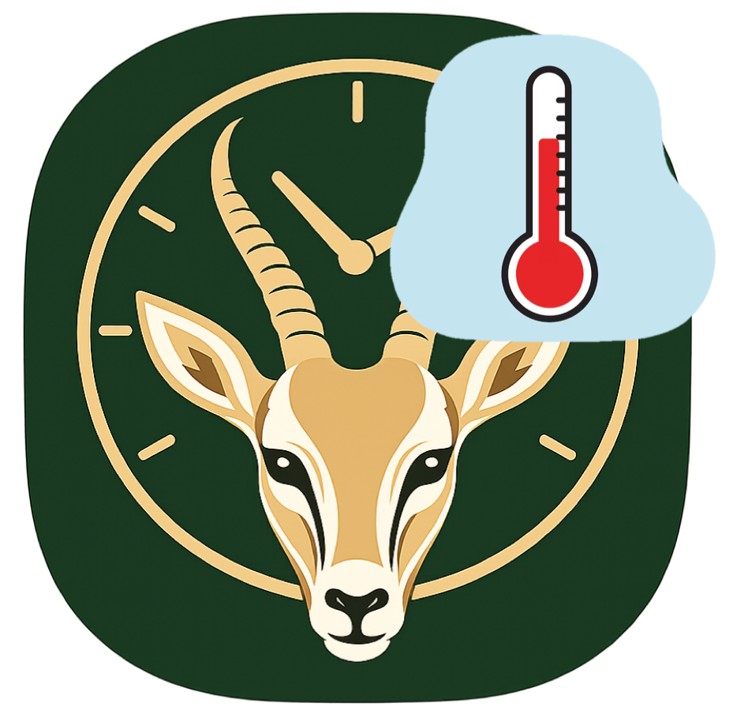

Set up respirometry schedule apps.
================

<!-- Short Description  -->

Shiny apps for creating the .txt files that control the respirometry
schedule.

<!-- README.md is generated from README.Rmd. Please edit that file -->

## Status

Project is: *in progress*

## How to create a desktop icon

To run the Shiny app more easily, you can create a desktop shortcut that
launches it directly from R.

#### *Step 1: Download the scripts*

Download all required `.R` files and store them in a folder on your
computer.

#### *Step 2: Locate Rscript on your computer*

Find the path to `Rscript.exe`. It is usually located in a folder like:

    C:\Program Files\R\R-4.5.3\bin\Rscript.exe

(Your version number and location may differ.)

#### *Step 3: Create a shortcut*

1.  Right-click on your Desktop  
2.  Select **New → Shortcut**  
3.  In the location field, paste:

<!-- -->

    "C:\Program Files\R\R-4.5.3\bin\Rscript.exe" "C:\path\to\the\app\run_app.R"

Replace `"C:\path\to\the\app\run_app.R"` with the actual path to your
script.

#### *Step 4: Name your shortcut*

Give it a meaningful name (e.g., *Respirometry Setup App*) and assign an
icon (some images (.ico) are available in the ‘App_icons’ folder in this
repository). Like for example:

#### *Step 5: Done*

Double-click the shortcut to launch the Shiny app.

## Troubleshooting

One reason launching may fail is if the required libraries are not
installed, so if that happens make sure to check the code and install
the required libraries.

## Contact

Created by [Matías I.
Muñoz](https://sites.google.com/view/matiasmunozsandoval/home)
